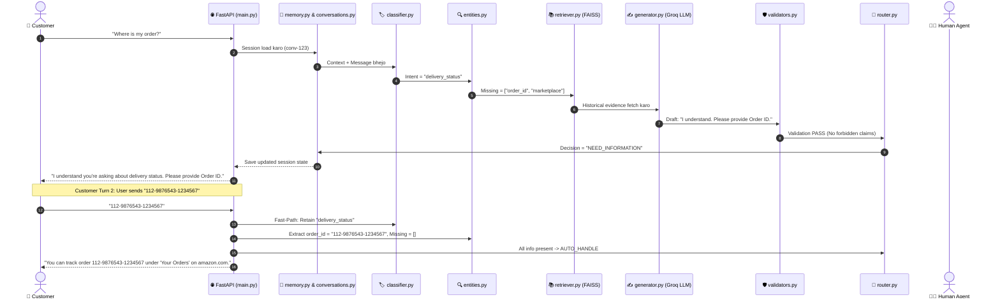

# Customer Support AI Agent - Complete Codebase Explanation (Hinglish Guide)

Yeh guide is pure project ke har ek folder, file, architecture aur logic ko **aasan Hinglish** me real-life examples ke sath explain karti hai. Isko padhne ke baad aapko poora system crystal clear samajh aa jayega ki kaunsi file kya karti hai aur ek doosre se kaise judi hui hai.

---

## Table of Contents
1. [Project Ka Main Purpose Kya Hai? (In Simple Words)](#1-project-ka-main-purpose-kya-hai)
2. [End-to-End Life of a Message (Real Example)](#2-end-to-end-life-of-a-message)
3. [Complete File-by-File Breakdown](#3-complete-file-by-file-breakdown)
   - [Agent Pipeline (`src/customer_support/agent/`)](#agent-pipeline-srccustomer_supportagent)
   - [Backend API (`src/customer_support/api/`)](#backend-api-srccustomer_supportapi)
   - [Storage Layer (`src/customer_support/storage/`)](#storage-layer-srccustomer_supportstorage)
   - [Config & Utils (`src/customer_support/config/`, `data/`, `evaluation/`)](#config--utils)
   - [Frontend Interfaces (`frontend/`)](#frontend-interfaces-frontend)
   - [Data Pipelines & Scripts (`scripts/`)](#data-pipelines--scripts-scripts)
   - [Testing Suite (`tests/`)](#testing-suite-tests)
   - [Data & Schema Files (`data/`)](#data--schema-files-data)
4. [Sabse Important Concept Samajhiye (HITL & Memory)](#4-sabse-important-concepts)

---

## 1. Project Ka Main Purpose Kya Hai?

Yeh project ek **Amazon-style Customer Support AI System** hai jo normal chatbot se 10x smarter aur safe hai:
1. **Chatbot Amnesia Khatam**: Agar user bole *"Where is my order?"* aur bot pooche *"Order ID do"*, aur user bole *"12345"*, toh normal bot bhool jata hai ki baat kya chal rahi thi. Hamara bot purani memory aur slots yaad rakhta hai.
2. **Hallucination Prevention**: Bot khud se jhoothe promises nahi karta (jaise *"Maine aapka refund issue kar diya hai"*). Agar refund ya sensitive issue ho, toh turant human agent ko handoff karta hai.
3. **Live Human-in-the-Loop (HITL)**: Jab conversation human ko escalate hoti hai, human support dashboard se live reply karta hai aur customer ko bina page refresh kiye 2.5 second ke andar reply mil jata hai.

---

## 2. End-to-End Life of a Message

Dekhiye jab customer message bhejta hai toh andar kya hota hai:



---

## 3. Complete File-by-File Breakdown

---

### Agent Pipeline (`src/customer_support/agent/`)

Yeh folder is pure system ka dimaag (Brain) hai. Yaha LangGraph ke 9 nodes hain.

#### 1. `state.py`
- **Kaam**: Pure pipeline me jo data ghumega uska **Blueprint / Type Definition** hai.
- **Kya store karta hai**:
  - `conversation_id`, `current_message`, `context_turns`
  - `intent`, `confidence`, `confidence_tier`
  - `collected_entities` (jo info mil chuki hai: `{"order_id": "123"}`)
  - `missing_entities` (jo bachi hai: `["marketplace"]`)
  - `evidence`, `draft_response`, `response_valid`, `decision`
- **Example**:
  ```python
  state = {
      "conversation_id": "conv-001",
      "current_message": "track my package",
      "intent": "delivery_status",
      "collected_entities": {},
      "missing_entities": ["order_id"]
  }
  ```

---

#### 2. `memory.py`
- **Kaam**: Database (`conversations.json`) se purani memory load karna aur naya reply save karna.
- **Functions**:
  - `load_conversation_memory(state)`: Pipeline ke START par chalta hai. Agar user ka conversation pehle se chal raha hai, toh pichla intent aur slots state me load kar deta hai.
  - `save_conversation_memory(state)`: Pipeline ke END par chalta hai. User ka message aur bot ka reply file me write karta hai.
- **Example**:
  - *Input*: `conversation_id = "conv-123"`
  - *Output*: State me add hua `collected_entities = {"order_id": "998877"}`.

---

#### 3. `context.py`
- **Kaam**: Pichli chat history ke last $N$ turns ko filter karke saaf format me ready karta hai taaki LLM ko background context mile.
- **Example**:
  - *Input*: 10 turns ki raw history
  - *Output*: `[CUSTOMER] Where is my item? -> [BRAND] What is your order ID?`

---

#### 4. `classifier.py`
- **Kaam**: Customer ke message ko 16 fixed intents me se kisi 1 me classify karna.
- **Special Features**:
  1. **Fast-Path**: Agar user sirf chota jawab de (jaise *"amazon.com"* ya *"12345"*), toh LLM call kiye bina ongoing intent maintain rakhta hai.
  2. **LLM Groq Call**: `llama-3.3-70b-versatile` se JSON me intent aur confidence leta hai.
  3. **Regex Fallback**: Agar Groq API rate limit (429) de de ya internet fail ho jaye, toh regex patterns ("human", "track", "refund") se intent guess karke pipeline ko crash hone se bacha leta hai.
- **Example**:
  - *Input*: `"I want my money back"`
  - *Output*: `{"intent": "refund_return", "confidence": 0.95}`

---

#### 5. `entities.py`
- **Kaam**: Slot-Filling engine. Message me se Order ID, Marketplace, Email, Phone number dhoondta hai.
- **Example**:
  - *Input message*: `"My order is 112-4567890-1234567 on amazon.in"`
  - *Output*:
    - `collected_entities = {"order_id": "112-4567890-1234567", "marketplace": "amazon.in"}`
    - `missing_entities = []`

---

#### 6. `retriever.py`
- **Kaam**: FAISS Vector Database se historical Amazon support cases dhoond kar lata hai jo current problem se match karte ho.
- **Kaise kaam karta hai**:
  - `SentenceTransformer("all-MiniLM-L6-v2")` se query ka vector banata hai (384 dimensions).
  - FAISS me Cosine similarity search karta hai ($Top-3$).
  - Agar similarity score $\ge 0.60$ hai toh `evidence_quality = "STRONG"`, warna `"WEAK"`.
- **Example**:
  - *Query*: `"how to reset firestick"`
  - *Retrieved Evidence*: `"Customer issue: Firestick frozen. Resolution: Hold Select + Play buttons for 5 seconds to restart." (Score: 0.82)`

---

#### 7. `generator.py`
- **Kaam**: Bot ka response draft karta hai.
- **Do Modes**:
  1. **Clarification Mode**: Agar `missing_entities` bache hain, toh polite sawal poochega: *"Please provide your Order ID."*
  2. **Grounded Resolution Mode**: Agar information poori hai, toh retrieved evidence ko use karke official solution draft karega aur citation reference (`ev-123`) dega.
- **Example Output**:
  ```json
  {
    "draft_response": "To track your package, visit 'Your Orders' on amazon.com.",
    "claims": ["Tracking is under Your Orders"],
    "grounding_refs": ["ev-10842"]
  }
  ```

---

#### 8. `validators.py`
- **Kaam**: Security Guard / Hallucination Inspector.
- **Kya check karta hai**:
  - **Forbidden Action Claims**: Check karta hai ki LLM ne galti se koi jhootha daawa toh nahi kiya (jaise *"I have refunded your money"*, *"I cancelled your order"*).
  - **Citation Verification**: Jo citations LLM ne quote kiye hain, kya wo sach me FAISS evidence me exist karte hain ya imaginary hain.
- **Example**:
  - Agar response me aaya: *"I have issued your refund of $50."*
  - Validator bolega: `response_valid = False`, `high_risk = True` (Turant human escalation trigger hogi).

---

#### 9. `router.py`
- **Kaam**: Final Traffic Police jo decide karta hai conversation kaha jayegi:
  - **`AUTO_HANDLE`**: Sab safe hai, information poori hai $\rightarrow$ AI ka reply seedha customer ko bhej do.
  - **`NEED_INFORMATION`**: Information missing hai $\rightarrow$ Customer se slot poochne wala question bhejo.
  - **`ESCALATE`**: User ne human manga, financial risk intent hai, ya validator ne reject kiya $\rightarrow$ Case ko Human Queue me daal do aur `HUMAN_ACTIVE` mode on kar do.

---

#### 10. `graph.py`
- **Kaam**: In saare 9 nodes ko **LangGraph StateGraph** me link karta hai:
  `START -> memory_load -> context -> classifier -> entities -> retriever -> generator -> validator -> router -> memory_save -> END`

---

#### 11. `orchestrator.py`
- **Kaam**: Helper wrapper function jo pipeline ko test karne aur standalone run karne ke kaam aata hai.

---

### Backend API (`src/customer_support/api/`)

#### `main.py`
- **Kaam**: FastAPI application jo Frontend aur Agent Pipeline ke beech bridge hai.
- **Key Endpoints**:
  1. `POST /chat`: Customer ka message leta hai.
     - **Special Logic (Sticky Human)**: Agar conversation `HUMAN_ACTIVE` me hai, toh AI pipeline run **nahi** hogi. Message seedha database me store ho jayega taaki human agent reply kar sake.
  2. `GET /chat/{conversation_id}/updates?after={message_id}`: Customer chat aur Human dashboard is endpoint ko poll karte hain live updates pane ke liye.
  3. `POST /escalations/{id}/reply`: Human agent dashboard se customer ko reply bhejta hai.
  4. `POST /escalations/{id}/approve`: AI ke draft response ko approve karke customer ko deliver karta hai.
  5. `POST /escalations/{id}/close`: Conversation ko close karta hai.
  6. `GET /`, `GET /support`, `GET /review`: Frontends serve karta hai.

---

### Storage Layer (`src/customer_support/storage/`)

#### 1. `conversations.py`
- **Kaam**: `conversations.json` file ke sath interact karta hai.
- **Classes**:
  - `ConversationMessage`: Har single message ka record (id, role, text, timestamp, sender).
  - `ConversationSession`: Pure session ki details (id, current_intent, slots, status).
  - `ConversationStore`: In-memory dictionary + automatic JSON disk persistence.

#### 2. `escalations.py`
- **Kaam**: `escalations_queue.json` file ke sath interact karta hai.
- **Classes**:
  - `Escalation`: Escalated case ka card (customer_message, ai_draft, reason, status: `PENDING`, `HUMAN_ACTIVE`, ya `CLOSED`).
  - `EscalationStore`: Pending escalations ki list aur statistics provide karta hai.

---

### Config & Utils

#### 1. `src/customer_support/config/setting.py`
- **Kaam**: Pydantic Settings class jo `.env` file se saari settings (`GROQ_API_KEY`, `LLM_MODEL`, `INTENT_CONFIDENCE_THRESHOLD`, etc.) type-safely load karti hai.

#### 2. `src/customer_support/data/preprocessing.py`
- **Kaam**: Text cleaning functions (URLs hatana, `@handles` scrub karna, agent signatures `^WT` hatana).

#### 3. `src/customer_support/evaluation/harness.py`
- **Kaam**: Metrics compute karne ka code (Precision, Recall, F1-Score, Confusion Matrix calculation for Golden Dataset evaluation).

---

### Frontend Interfaces (`frontend/`)

#### 1. Customer Chat (`index.html`, `script.js`, `style.css`)
- **URL**: `http://localhost:8000/`
- **Kaam**: Customer ke baat karne ke liye live chat screen.
- **Special Feature**: Isme background me `startPollingForUpdates()` chalta hai (har 2.5s me). Jab Human agent dashboard se reply bhejta hai, toh customer ki screen par bina reload kiye turant `🧑‍💼 Human Support Agent` ka message popup ho jata hai.

#### 2. Minimal Human Support Dashboard (`support.html`, `support.js`, `support.css`)
- **URL**: `http://localhost:8000/support`
- **Kaam**: Customer Care Representatives ke liye banaya gaya simplified dashboard.
- **Features**:
  - Latest customer message dikhata hai.
  - Reply likhne ke liye `<textarea>` aur `[📤 Send Response]` button.
  - **Draft Protection Logic**: Agar agent type kar raha hai, toh polling ke dauran DOM re-render **nahi** hota, jisse agent ka likha hua text delete nahi hota.

#### 3. Developer / Diagnostic Dashboard (`review.html`, `review.js`, `review.css`)
- **URL**: `http://localhost:8000/review`
- **Kaam**: Engineers aur developers ke liye detailed view. Isme intent, confidence %, FAISS evidence quality, AI reasoning, aur full pipeline metadata visible hota hai.

---

### Data Pipelines & Scripts (`scripts/`)

#### 1. `prepare_data.py`
- **Kaam**: Kaggle ke 500MB raw dataset (`twcs.csv`) me se `@AmazonHelp` ke tweets filter karta hai aur parent-child mapping chala kar poore conversation threads reconstruct karta hai (`amazon_conversations_raw.jsonl`).

#### 2. `clean_data.py`
- **Kaam**: Raw conversations me se URLs aur handles clean karta hai, aur `langdetect` library se non-English dialogues ko alag kar deta hai (`amazon_conversations_clean.jsonl`).

#### 3. `build_index.py`
- **Kaam**: Clean conversations me se Problem + Resolution pairs nikalta hai, SentenceTransformers se 384-dimensional embeddings banata hai, aur unhe FAISS index (`amazon_evidence.index`) aur metadata (`evidence_metadata.pkl`) me save karta hai.

#### 4. `run_evaluation.py`
- **Kaam**: Hand-labeled benchmark dataset (`golden_set_final.jsonl`) ke 211 test cases par poora pipeline run karke accuracy, precision, recall aur confusion matrix report generate karta hai (`evaluation/reports/pipeline_evaluation_results.json`).

---

### Testing Suite (`tests/`)

#### 1. `test_end_to_end.py`
- **Kaam**: FastAPI TestClient se 7 critical workflows ka automatic test run karta hai:
  1. Multi-turn slot filling (Order ID + Marketplace collection).
  2. Explicit human escalation.
  3. AI silencing during `HUMAN_ACTIVE` state.
  4. Human approval response delivery.
  5. Incremental updates filtering (`?after={id}`).
  6. Sequential human replies in sticky mode.
  7. Final conversation closure via `/close`.

#### 2. `test_groq.py`
- **Kaam**: Groq API key aur LLM connectivity ka basic ping test.

---

### Data & Schema Files (`data/`)

#### 1. `data/schemas/intent_taxonomy_v1.md`
- 16 standard intent definitions (e.g., `delivery_status`, `refund_return`, `account_access`, `payment_billing`, `human_assistance_request`, etc.).

#### 2. `data/schemas/golden_set_final.jsonl`
- 211 ground-truth hand-verified customer questions jinke against pipeline ki accuracy test hoti hai.

#### 3. `data/processed/faiss_index/`
- `amazon_evidence.index`: FAISS vector index binary file.
- `evidence_metadata.pkl`: Pickled metadata lookup table.

---

## 4. Sabse Important Concepts

### Concept A: Sticky Human Mode (Human Takeover)
```
User: "I want to talk to a human"
  ↓
Router: Decision = ESCALATE
  ↓
API: Session status = HUMAN_ACTIVE
  ↓
Jab customer next message bhejega ("Hello?"), toh:
  ❌ AI Pipeline RUN NAHI HOGI (LLM/FAISS bypass).
  ✅ Message seedha database me store hoga.
  ✅ Human Agent apne dashboard se reply karega.
```

### Concept B: Slot Filling Without Amnesia
```
Turn 1: "Where is my order?" -> Intent: delivery_status | Missing: order_id
Turn 2: "112-9876543-1234567"
  ❌ Normal Chatbot: "112-9876543..." ko UNKNOWN samajh ke confuse ho jata hai.
  ✅ Hamara System: Fast-path aur memory_load se purana intent "delivery_status" yaad rakhta hai aur Order ID extract karke solution de deta hai.
```

### Concept C: Smart DOM Draft Protection
```
Human Agent dashboard me type kar raha hai: "Hello sir, I am checking your order..."
  ↓
Background polling har 5 second me backend se fresh data laati hai.
  ❌ Normal JS: container.innerHTML = newHTML (Agent ka likha hua text gayab ho jata hai).
  ✅ Hamara JS: activeEditForms Set check karta hai. Agar card active hai, toh textarea ko chhu-ta tak nahi hai!
```

---

## Quick Summary Table

| Folder / File | Ek Line Me Kaam |
| :--- | :--- |
| `src/customer_support/agent/classifier.py` | Intent pehchanta hai (with Regex Fallback) |
| `src/customer_support/agent/entities.py` | Order ID, Marketplace, Email nikalta hai |
| `src/customer_support/agent/retriever.py` | FAISS vector index se historical solution lata hai |
| `src/customer_support/agent/generator.py` | Polite answer ya clarification draft karta hai |
| `src/customer_support/agent/validators.py` | Jhoothe promises aur claims ko block karta hai |
| `src/customer_support/agent/router.py` | AUTO_HANDLE, NEED_INFO ya ESCALATE decide karta hai |
| `src/customer_support/api/main.py` | FastAPI server aur sticky human routing handle karta hai |
| `src/customer_support/storage/` | Multi-turn chat aur human escalation queues store karta hai |
| `frontend/script.js` | Customer live chat + 2.5s polling controller |
| `frontend/support.js` | Human agent dashboard + draft protection |
| `scripts/build_index.py` | FAISS vector database build karta hai |
| `tests/test_end_to_end.py` | Pure system ke 7 integration tests chalata hai |
