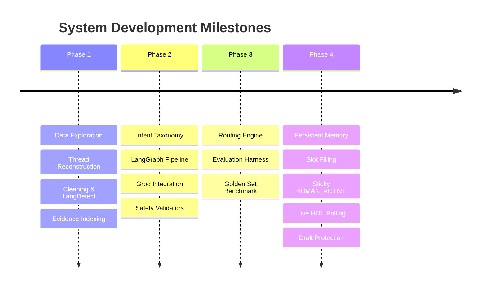
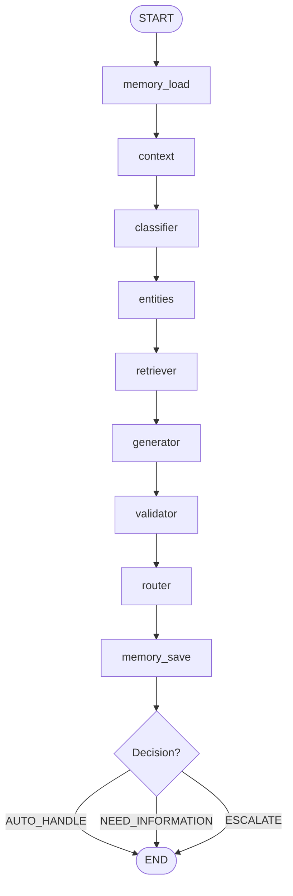
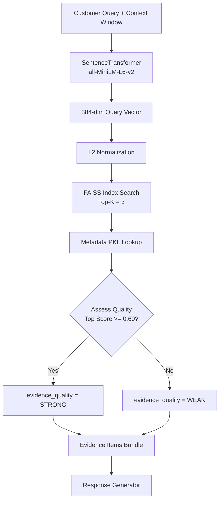
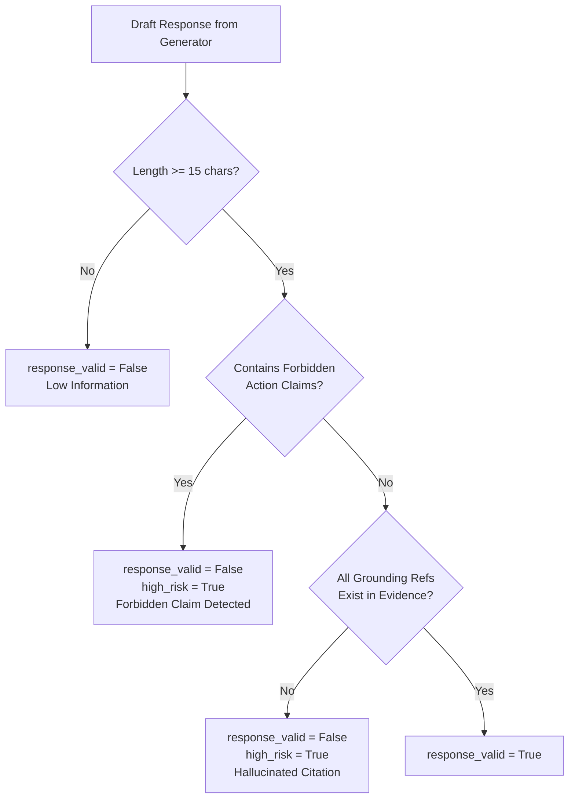
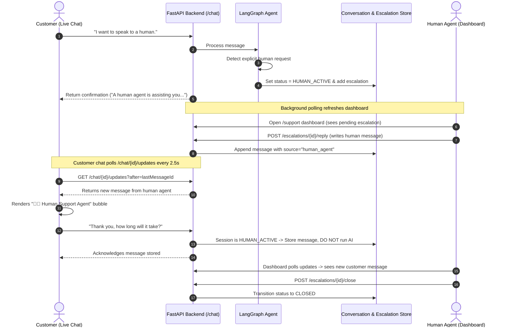

# Customer Support AI Agent (AmazonHelp Case Study)

[](https://www.python.org/downloads/)
[](https://fastapi.tiangolo.com)
[](https://github.com/langchain-ai/langgraph)
[](https://groq.com/)
[](https://github.com/facebookresearch/faiss)
[](https://opensource.org/licenses/MIT)

> An enterprise-grade, stateful customer support assistant designed for high-risk e-commerce workflows (AmazonHelp style). The system combines persistent multi-turn memory, context-aware slot filling, RAG over historical resolutions, safety-constrained response generation, validator guardrails, intelligent routing, and a real-time Human-in-the-Loop (HITL) escalation and live messaging pipeline.

---

## Table of Contents
1. [Project Overview](#project-overview)
2. [Why This Project Was Built](#why-this-project-was-built)
3. [High-Level Architecture](#high-level-architecture)
4. [Project Journey — Beginning to End](#project-journey--beginning-to-end)
5. [Data Pipeline & Evidence Indexing](#data-pipeline--evidence-indexing)
6. [Agent Architecture & State Machine](#agent-architecture--state-machine)
7. [Conversation Memory & Contextual Slot-Filling](#conversation-memory--contextual-slot-filling)
8. [Retrieval-Augmented Generation (RAG)](#retrieval-augmented-generation-rag)
9. [Response Generation & Grounding Constraints](#response-generation--grounding-constraints)
10. [Safety Validation & Hallucination Guardrails](#safety-validation--hallucination-guardrails)
11. [Intelligent Routing States](#intelligent-routing-states)
12. [Human-in-the-Loop (HITL) Workflow](#human-in-the-loop-hitl-workflow)
13. [Sticky Human Mode](#sticky-human-mode)
14. [Live Customer & Human Message Synchronization](#live-customer--human-message-synchronization)
15. [Human Support Dashboard](#human-support-dashboard)
16. [Human Draft Protection During Polling](#human-draft-protection-during-polling)
17. [Evaluation Results & Metrics](#evaluation-results--metrics)
18. [Project Structure](#project-structure)
19. [Tech Stack](#tech-stack)
20. [Installation & Local Setup](#installation--local-setup)
21. [How to Run Tests](#how-to-run-tests)
22. [Repository Access](#repository-access)

---

## Project Overview

Modern customer support systems cannot rely on naive chatbots. In e-commerce and financial support domains, generic large language models (LLMs) pose severe operational risks: they hallucinate refund guarantees, promise unauthorized order cancellations, lose context across turns, and fail to hand off smoothly when customers demand human assistance.

This repository implements a **conservative, stateful, resolution-grounded AI agent pipeline** backed by real Twitter customer support data (`@AmazonHelp`). It does not simply generate text; it executes a deterministic 9-node LangGraph pipeline with strict safety gates:

- **Stateful Multi-Turn Memory**: Tracks conversation threads and retains intent across slot-filling interactions.
- **Resolution-Aware RAG**: Embeds historical resolution pairs using `all-MiniLM-L6-v2` and searches a FAISS index to find verified precedents.
- **Context-Aware Intent Classification**: Classifies customer queries across a 16-intent taxonomy with regex-backed resilience.
- **Safety Validators**: Enforces regex-based forbidden claim filtering (e.g., blocking false "your refund has been processed" promises) and verifies evidence grounding citations.
- **Smart Decision Routing**: Separates actionable auto-responses (`AUTO_HANDLE`), slot-gathering questions (`NEED_INFORMATION`), and critical escalations (`ESCALATE`).
- **Live Human-in-the-Loop (HITL)**: Instantly transitions escalated conversations into sticky human mode, delivers live agent responses to the user within seconds, and synchronizes two-way customer-agent updates without DOM or textarea destruction.

---

## Why This Project Was Built

In high-stakes support environments, **false confidence is worse than asking for help**.

### Key Problems Solved:
1. **The Chatbot Amnesia Problem**: When an AI asks "Please provide your Order ID", and the customer replies "123456", standard classifiers treat "123456" as a new query and classify it as `UNKNOWN` or issue an irrelevant response. This system maintains conversational state and extracts entity slots without losing context.
2. **Over-Escalation vs. Dangerous Automation**: Naive systems either automate recklessly (causing compliance violations) or escalate every minor query. This architecture isolates `NEED_INFORMATION` (gathering missing slots) from `ESCALATE` (genuine financial, security, or explicit human requests).
3. **The Broken Handoff (The "Void" Problem)**: In many HITL prototypes, an escalation is created in a database, but the customer never receives the human agent's approved or custom reply. Here, live incremental polling synchronizes human agent messages into the customer's active chat session.
4. **Draft Loss During Agent Review**: Standard browser dashboards re-render the DOM periodically, wiping out what a support agent was actively typing. Our smart DOM diffing preserves focus, textareas, and active input forms.

---

## High-Level Architecture

```mermaid
flowchart TD
    subgraph Client ["Customer Interface"]
        C[Customer Message]
        ChatUI[Live Chat Window]
    end

    subgraph Pipeline ["LangGraph 9-Node Agent Pipeline"]
        N1[1. memory_load<br/>Load Persistent Session] --> N2[2. context<br/>Build Context Window]
        N2 --> N3[3. classifier<br/>Classify 16 Intents + Fallback]
        N3 --> N4[4. entities<br/>Extract Slots & Missing Entities]
        N4 --> N5[5. retriever<br/>FAISS Top-K Evidence Retrieval]
        N5 --> N6[6. generator<br/>Draft Response / Clarification]
        N6 --> N7[7. validator<br/>Forbidden Claim & Grounding Check]
        N7 --> N8[8. router<br/>Decision Engine]
        N8 --> N9[9. memory_save<br/>Persist Messages & Slots]
    end

    subgraph Decisions ["Routing States"]
        D1[AUTO_HANDLE<br/>Deliver Grounded AI Reply]
        D2[NEED_INFORMATION<br/>Ask for Missing Order/Marketplace]
        D3[ESCALATE<br/>Transition to HUMAN_ACTIVE]
    end

    subgraph HumanLoop ["Human-in-the-Loop System"]
        Dashboard["Human Support Dashboard<br/>(/support & /review)"]
        HumanAgent["Human Support Agent<br/>Approve / Edit / Custom Reply"]
    end

    C --> N1
    N9 --> N8
    N8 -->|Safe & Resolved| D1
    N8 -->|Missing Slots| D2
    N8 -->|Risk / Escalation / Human Ask| D3

    D1 --> ChatUI
    D2 --> ChatUI
    D3 --> Dashboard

    Dashboard --> HumanAgent
    HumanAgent -->|POST /escalations/{id}/reply| N9
    N9 -.->|Live Incremental Polling| ChatUI
```

---

## Project Journey — Beginning to End

The development of this project followed an evolutionary engineering approach, moving from raw conversational data to a stateful, human-supervised system:



### 1. Problem Definition & Domain Scope
- **What**: Formulated requirements for an enterprise Amazon customer support assistant.
- **Why**: Prevent LLM hallucinations, enforce strict refund/cancellation safeguards, and handle multi-turn customer dialogues reliably.
- **Files**: `data/schemas/decision_log.md`, `README.md`

### 2. Dataset Preparation & Brand Filtering
- **What**: Filtered Kaggle's Customer Support on Twitter (`twcs.csv`) to isolate `@AmazonHelp` interactions (over 60,000+ interactions).
- **Why**: Single-brand focus allows high precision in intent modeling, policy adherence, and resolution retrieval.
- **Files**: `scripts/prepare_data.py`

### 3. Thread Reconstruction (`find_root` & Graph Traversal)
- **What**: Built a reverse parent-child reply map and graph crawler to reconstruct full conversational threads from disjointed tweets.
- **Why**: Single tweets lack context; multi-turn context is required to determine whether an issue was successfully resolved.
- **Files**: `scripts/prepare_data.py` (Outputs: `data/processed/amazon_conversations_raw.jsonl`)

### 4. Text Normalization, URL Scrubbing & Language Filtering
- **What**: Stripped agent signatures (`^WT`), URLs, user handles (`@AmazonHelp`), and normalized whitespace. Filtered non-English dialogues via `langdetect`.
- **Why**: Agent signatures and URLs pollute semantic embeddings; non-English turns degrade classifier accuracy.
- **Files**: `scripts/clean_data.py` (Outputs: `data/processed/amazon_conversations_clean.jsonl`, `amazon_conversations_flagged.jsonl`)

### 5. Resolution-Aware Evidence Unit Extraction
- **What**: Formatted verified customer-brand conversation pairs into paired evidence units: `"Customer issue: <text> Resolution: <text>"`.
- **Why**: Retrieval needs both the complaint and the approved resolution to ground the LLM's drafting stage.
- **Files**: `scripts/build_index.py`

### 6. Semantic Vector Embeddings
- **What**: Encoded all clean evidence units into dense 384-dimensional vectors using `SentenceTransformer("all-MiniLM-L6-v2")`.
- **Why**: Lightweight, low-latency, high-accuracy semantic representation.
- **Files**: `scripts/build_index.py`

### 7. FAISS Vector Index Construction
- **What**: Built an L2-normalized cosine similarity vector index with serialized metadata lookups.
- **Why**: Sub-millisecond similarity retrieval over historical support cases without spinning up external vector database servers.
- **Files**: `scripts/build_index.py` (Outputs: `data/processed/faiss_index/amazon_evidence.index`, `evidence_metadata.pkl`)

### 8. Intent Taxonomy Definition (16 Intents + Unknown)
- **What**: Defined an authoritative 16-intent taxonomy tailored to Amazon support (`delivery_status`, `refund_return`, `account_access`, `human_assistance_request`, etc.).
- **Why**: Standardized categorization enables deterministic routing and safety constraints.
- **Files**: `data/schemas/intent_taxonomy_v1.md`

### 9. LangGraph AgentState Schema
- **What**: Formatted a comprehensive `AgentState` TypedDict holding message history, slots, evidence scores, validation flags, and routing decisions.
- **Why**: Provides a single typed state object passed across all pipeline nodes.
- **Files**: `src/customer_support/agent/state.py`

### 10. Multi-Turn Conversation Memory Architecture
- **What**: Implemented `ConversationStore` with file-backed JSON persistence (`conversations.json`) and session management.
- **Why**: Enables persistent multi-turn conversations across browser refreshes and asynchronous user requests.
- **Files**: `src/customer_support/storage/conversations.py`, `src/customer_support/agent/memory.py`

### 11. Entity Extraction & Slot Filling
- **What**: Built deterministic regex entity extractors for `order_id`, `marketplace`, `email`, `phone`, and `tracking_number`.
- **Why**: Conversational slot-filling ensures the agent collects necessary data before escalating or answering.
- **Files**: `src/customer_support/agent/entities.py`

### 12. Context-Aware Intent Classifier with Fast-Path & Fallbacks
- **What**: Built an LLM classifier using Groq (`llama-3.3-70b-versatile`) with fast-path heuristics for slot responses and regex-based fallback on API rate limits.
- **Why**: Prevents conversational amnesia on short slot answers and guarantees high availability during external API outages.
- **Files**: `src/customer_support/agent/classifier.py`

### 13. Context-Enriched Vector Retrieval
- **What**: Query synthesis combining recent conversation history with current message before querying the FAISS index.
- **Why**: Ambiguous follow-ups (e.g., "where is it now?") retrieve accurate evidence by including earlier turns.
- **Files**: `src/customer_support/agent/retriever.py`

### 14. Grounded Response Generator
- **What**: Prompted Groq LLaMA 3.3 70B with strict grounding rules to produce structured JSON responses with explicit claim arrays and citation references.
- **Why**: Constrains the model to act as a drafting assistant rather than an ungrounded generator.
- **Files**: `src/customer_support/agent/generator.py`

### 15. Safety Validation Engine
- **What**: Post-generation regex filters checking for forbidden completion claims (e.g., "I have refunded your order") and citation validity.
- **Why**: Ensures the AI never promises irreversible operational actions it cannot execute.
- **Files**: `src/customer_support/agent/validators.py`

### 16. Smart Router (NEED_INFO vs. AUTO_HANDLE vs. ESCALATE)
- **What**: Decision logic that checks explicit human requests, missing entities, validation failures, and financial risk intents.
- **Why**: Minimizes false escalations for normal queries needing clarification while safeguarding high-risk intents.
- **Files**: `src/customer_support/agent/router.py`

### 17. FastAPI Application Server
- **What**: Built REST endpoints for chatting, incremental message polling, escalation management, and static asset delivery.
- **Why**: Bridges the LangGraph agent backend with web frontends and external integrations.
- **Files**: `src/customer_support/api/main.py`

### 18. Human-in-the-Loop Storage & Queue
- **What**: Implemented `EscalationStore` (`escalations_queue.json`) to persist cases awaiting human intervention.
- **Why**: Ensures human agents have full visibility into customer messages, AI suggestions, and escalation rationales.
- **Files**: `src/customer_support/storage/escalations.py`

### 19. Sticky Human Mode (AI Silencing)
- **What**: Added an entry-point check in `/chat` that bypasses the AI pipeline once a conversation enters `HUMAN_ACTIVE`.
- **Why**: Prevents the AI from interrupting, re-classifying, or overwriting active human agent conversations.
- **Files**: `src/customer_support/api/main.py`

### 20. Live Human-to-Customer Message Synchronization
- **What**: Developed incremental polling (`GET /chat/{id}/updates?after={lastMessageId}`) in `script.js`.
- **Why**: Enables instant delivery of approved or custom human replies to the customer's chat screen within 2.5 seconds.
- **Files**: `frontend/script.js`, `src/customer_support/api/main.py`

### 21. Live Customer-to-Dashboard Updates
- **What**: Added background polling in the human dashboard to capture new customer messages sent while under human control.
- **Why**: Allows support agents to engage in real-time two-way conversations without manual page reloads.
- **Files**: `frontend/support.js`, `frontend/review.js`

### 22. Smart DOM Re-Rendering (Textarea Preservation)
- **What**: Implemented active form tracking (`activeEditForms` Set) that skips DOM updates on cards where a human is typing.
- **Why**: Prevents background polling from destroying active textareas, wiping agent drafts, or dropping input focus.
- **Files**: `frontend/support.js`, `frontend/review.js`

### 23. Two-Tier Frontend (Support Agent vs. Developer View)
- **What**: Designed a clean, distraction-free support interface (`/support`) and preserved the complete diagnostic dashboard (`/review`).
- **Why**: Support agents get a clean interface focused on customer communication, while engineers retain full debugging visibility.
- **Files**: `frontend/support.html`, `frontend/review.html`, `frontend/index.html`

### 24. Explicit Conversation Closure
- **What**: Added `POST /escalations/{id}/close` endpoint to resolve cases, transition status to `CLOSED`, and cleanly reset sessions.
- **Why**: Completes the support lifecycle and allows customers to start fresh requests.
- **Files**: `src/customer_support/api/main.py`, `src/customer_support/storage/conversations.py`

---

## Data Pipeline & Evidence Indexing

```mermaid
flowchart LR
    A[data/raw/twcs.csv<br/>Kaggle Twitter Support Dataset] -->|scripts/prepare_data.py| B[Thread Reconstruction<br/>find_root + child traversal]
    B --> C[data/processed/amazon_conversations_raw.jsonl]
    C -->|scripts/clean_data.py| D[URL & Mention Scrubbing<br/>LangDetect Filter]
    D --> E[data/processed/amazon_conversations_clean.jsonl]
    E -->|scripts/build_index.py| F[Extract Evidence Units<br/>Customer Issue + Brand Resolution]
    F -->|SentenceTransformer<br/>all-MiniLM-L6-v2| G[Dense Vectors<br/>384-dimensional]
    G --> H[data/processed/faiss_index/<br/>amazon_evidence.index + metadata.pkl]
```



### Artifact Manifest

| Path | Description | Generated By | Purpose |
|------|-------------|--------------|---------|
| `data/raw/twcs.csv` | Raw Twitter Customer Support CSV | External (Kaggle) | Base source dataset |
| `data/processed/amazon_conversations_raw.jsonl` | Reconstructed multi-turn conversation threads | `scripts/prepare_data.py` | Chronological multi-turn conversations |
| `data/processed/amazon_conversations_clean.jsonl` | Cleaned, normalized English dialogues | `scripts/clean_data.py` | Noise-free dialogues for indexing & training |
| `data/processed/amazon_conversations_flagged.jsonl` | Discarded non-English / empty turns | `scripts/clean_data.py` | Data hygiene audit trail |
| `data/processed/faiss_index/amazon_evidence.index` | FAISS L2-normalized vector index | `scripts/build_index.py` | Sub-millisecond vector similarity search |
| `data/processed/faiss_index/evidence_metadata.pkl` | Serialized metadata (resolution text, IDs) | `scripts/build_index.py` | Text lookup for retrieved vector IDs |
| `data/schemas/golden_set_final.jsonl` | Hand-verified benchmark golden set | Domain labeling | Pipeline evaluation benchmark |

---

## Agent Architecture & State Machine

The core intelligence is modeled as a state graph using **LangGraph**. Every turn initializes or resumes an `AgentState` object that flows sequentially through 9 specialized nodes.



### Agent Component Breakdown

| Node | File | Responsibility | Inputs | Outputs |
|------|------|----------------|--------|---------|
| `memory_load` | `agent/memory.py` | Retrieves session from `ConversationStore` or initializes new session | `conversation_id` | `current_intent`, `collected_entities`, `conversation_status` |
| `context` | `agent/context.py` | Extracts last $N$ relevant turns for prompt context | `context_turns`, `current_message` | `relevant_context`, `context_used` |
| `classifier` | `agent/classifier.py` | Classifies intent into 16 categories using LLM with fast-path & regex fallbacks | `current_message`, `current_intent`, `relevant_context` | `intent`, `confidence`, `confidence_tier` |
| `entities` | `agent/entities.py` | Extracts slots (`order_id`, `marketplace`, `email`, `phone`) and identifies missing slots | `current_message`, `intent`, `collected_entities` | `collected_entities`, `missing_entities` |
| `retriever` | `agent/retriever.py` | Encodes query with context and retrieves top-$k$ evidence from FAISS | `current_message`, `relevant_context` | `evidence`, `evidence_quality` |
| `generator` | `agent/generator.py` | Synthesizes clarification questions or grounded JSON responses | `intent`, `evidence`, `missing_entities`, `collected_entities` | `draft_response`, `claims`, `limitations`, `grounding_refs` |
| `validator` | `agent/validators.py` | Audits response against forbidden completion claims and citation validity | `draft_response`, `grounding_refs`, `evidence` | `response_valid`, `high_risk` |
| `router` | `agent/router.py` | Determines action: `AUTO_HANDLE`, `NEED_INFORMATION`, or `ESCALATE` | All state flags, validation results, entities, intent | `decision`, `escalation_reason`, `conversation_status` |
| `memory_save` | `agent/memory.py` | Writes user message, AI reply, and updated slots back to disk | All state fields | Persisted `ConversationSession` in `conversations.json` |

---

## Conversation Memory & Contextual Slot-Filling

The system avoids chatbot amnesia by executing deterministic slot filling and intent preservation.

### How It Works:
1. When a user mentions a broad query (e.g., *"Where is my package?"*), the classifier tags the intent as `delivery_status`.
2. The `entities` node identifies that `delivery_status` requires an `order_id` and `marketplace`.
3. The generator enters `NEED_INFO` mode and asks: *"To help you with this, please provide your Order ID and marketplace."*
4. On Turn 2, the user simply replies: *"amazon.com"*.
5. Instead of re-classifying "amazon.com" as a new query or `UNKNOWN`, the **Fast-Path Heuristic** recognizes an active intent and a slot value, preserves `delivery_status`, records `{"marketplace": "amazon.com"}`, and asks for the remaining `order_id`.
6. On Turn 3, the user replies: *"123-4567890-1234567"*. The order ID is extracted, all required slots are satisfied, and the agent transitions to `AUTO_HANDLE`.

```
[Turn 1] User: "Where is my order?"
         AI:   "I understand you're asking about delivery status. To help you with this, please provide your Order ID." (NEED_INFORMATION)

[Turn 2] User: "amazon.com"
         AI:   "I understand you're asking about delivery status. I have: marketplace: amazon.com. To help you with this, please provide your Order ID." (NEED_INFORMATION)

[Turn 3] User: "112-9876543-1234567"
         AI:   "You can track your package by visiting 'Your Orders' on amazon.com and selecting 'Track Package' next to order 112-9876543-1234567." (AUTO_HANDLE)
```

---

## Retrieval-Augmented Generation (RAG)



### Retrieval Mechanics
- **Model**: `all-MiniLM-L6-v2` (384 dimensions, cosine distance via normalized L2).
- **Index**: `faiss.IndexFlatIP` on normalized vectors.
- **Evidence Format**: Combined customer problem and verified brand resolution text.
- **Quality Metric**:
  - `STRONG`: Top similarity score $\ge 0.60$.
  - `WEAK`: Top similarity score $< 0.60$.
  - `NONE`: Empty query or index lookup failure.

---

## Response Generation & Grounding Constraints

The LLM is prompted under strict operational boundaries via Groq (`llama-3.3-70b-versatile`):

```json
{
  "draft_response": "To track your shipment, please check 'Your Orders' on amazon.com for real-time tracking updates.",
  "claims": [
    "Tracking is available under Your Orders on amazon.com"
  ],
  "limitations": [],
  "grounding_refs": [
    "ev-10842"
  ]
}
```

### Grounding Rules Enforced:
- The model **NEVER** executes actions (it only drafts customer communications).
- It cannot invent refund amounts, policy timelines, or shipping guarantees.
- Any citation in `grounding_refs` must exist in the retrieved evidence list (verified by `validators.py`).

---

## Safety Validation & Hallucination Guardrails



### Forbidden Action Phrases Filtered:
The validator actively rejects responses containing claims such as:
- `r"\byour refund has been (processed|issued|completed)\b"`
- `r"\byour replacement has been (sent|shipped|arranged)\b"`
- `r"\bi have (cancelled|canceled) your\b"`
- `r"\byour order has been (cancelled|canceled)\b"`
- `r"\bi've (processed|issued) (a |your )?refund\b"`

If any forbidden phrase is detected, `response_valid` is set to `False`, `high_risk` is set to `True`, and the case is escalated to human review.

---

## Intelligent Routing States

| State | Condition | Agent Action | Next Step |
|-------|-----------|--------------|-----------|
| `AUTO_HANDLE` | Safe intent, high confidence ($\ge 0.70$), valid response, all required entities collected | Delivers grounded AI response directly to user | Await next customer message |
| `NEED_INFORMATION` | Valid intent, but required slots (`order_id`, `marketplace`, etc.) missing | Generates targeted clarification question | User provides missing slot |
| `ESCALATE` | Explicit human request, financial risk intent, validator failure, or sensitive complaint | Halts AI automation, creates escalation record, enters `HUMAN_ACTIVE` | Human agent notified in dashboard |
| `HUMAN_ACTIVE` | Escalation approved or ongoing human interaction | Bypasses AI completely; stores customer message for human agent | Human replies via dashboard |
| `CLOSED` | Human agent clicks "Close Conversation" | Marks case resolved; resets session | Customer can start new chat |

---

## Human-in-the-Loop (HITL) Workflow



---

## Sticky Human Mode

When an escalation triggers:
1. The conversation enters `HUMAN_ACTIVE` mode immediately.
2. The `/chat` entry point checks `session.status == "HUMAN_ACTIVE"`.
3. If active, **the AI pipeline is completely bypassed**:
   - No intent re-classification.
   - No FAISS retrieval.
   - No LLM generation.
4. The customer's message is stored directly in `ConversationStore`.
5. The human agent retains full conversational control until explicitly clicking **Close Conversation**.

---

## Live Customer & Human Message Synchronization

Synchronization between the customer chat and human support dashboard runs via non-blocking incremental polling:

```mermaid
flowchart LR
    CustomerChat["Customer Chat (script.js)"] -->|Poll every 2.5s<br/>GET /chat/{id}/updates?after=msg_123| Backend["FastAPI Backend"]
    Backend -->|Return new messages| CustomerChat
    
    SupportDashboard["Human Dashboard (support.js)"] -->|Poll every 5.0s<br/>GET /chat/{id}/updates| Backend
    Backend -->|Return customer turns| SupportDashboard
    
    SupportDashboard -->|POST /escalations/{id}/reply| Backend
    Backend -->|Store in ConversationStore| Storage[conversations.json]
```

- **Incremental Polling**: `GET /chat/{conversation_id}/updates?after={lastMessageId}` guarantees that only unrendered messages are transferred, preventing duplicate DOM renders and reducing network overhead.
- **Latency**: Customer receives human responses within $\le 2.5$ seconds.

---

## Human Support Dashboard

Two purpose-built web interfaces are available:

### 1. Minimal Support Dashboard (`/support`)
A clean, focused workspace designed for customer service representatives:

```
┌───────────────────────────────────────────────────────────────────────────┐
│ 🧑‍💼 Human Support Dashboard               [1 active chat] [🔄 Refresh]     │
├───────────────────────────────────────────────────────────────────────────┤
│ [New Requests]  [Active Chats (1)]  [Closed]                              │
├───────────────────────────────────────────────────────────────────────────┤
│ 2:45:12 PM                                            [🟣 HUMAN ACTIVE]   │
│ Reason: explicit human assistance request detected                        │
│                                                                           │
│ ┌───────────────────────────────────────────────────────────────────────┐ │
│ │ Latest Customer Message:                                              │ │
│ │ "I want to speak with a human about my damaged order."                │ │
│ └───────────────────────────────────────────────────────────────────────┘ │
│                                                                           │
│ 📜 Show conversation history                                              │
│                                                                           │
│ ┌───────────────────────────────────────────────────────────────────────┐ │
│ │ Response Editor:                                                      │ │
│ │ Hello! I am Sarah from Amazon Support. I am reviewing your order now. │ │
│ └───────────────────────────────────────────────────────────────────────┘ │
│                                                                           │
│ [📤 Send Response]                             [🔒 Close Conversation]   │
└───────────────────────────────────────────────────────────────────────────┘
```

### 2. Developer Diagnostic Dashboard (`/review`)
A diagnostic console exposing complete internal state:
- Detected intent and confidence percentage.
- Evidence quality rating (`STRONG` / `WEAK` / `NONE`).
- Full JSON pipeline metadata and validation error logs.
- AI draft suggestions alongside escalation rationales.

---

## Human Draft Protection During Polling

### The Problem
In standard browser interfaces using `setInterval` to refresh data, calling `container.innerHTML = ...` destroys active `<textarea>` elements, causing agents to lose in-progress typing whenever background polling fires.

### The Solution (`support.js` & `review.js`)
1. **Focus Tracking**: When an agent focuses on a textarea, `markFormActive(id)` adds the card ID to an `activeEditForms` Set.
2. **Smart DOM Updating**: The polling loop checks `activeEditForms.has(id)`. If the agent is editing, the card's outer HTML is left untouched.
3. **Selective Sub-tree Mutation**: If new customer messages arrive while the agent is typing, only the history container updates—preserving the agent's active draft, caret position, and focus.

---

## Evaluation Results & Metrics

The agent pipeline was evaluated against a hand-labeled benchmark of 211 real-world Amazon customer support interactions (`data/schemas/golden_set_final.jsonl`).

### Summary Metrics (`evaluation/reports/pipeline_evaluation_results.json`)

```json
{
  "sample_size": 211,
  "intent_classification": {
    "accuracy": 0.635,
    "weighted_f1": 0.656,
    "macro_precision": 0.663
  },
  "escalation_routing": {
    "accuracy": 0.592,
    "escalation_precision": 0.614,
    "escalation_recall": 0.569,
    "confusion_matrix": {
      "true_escalate (TP)": 62,
      "false_escalate_overcautious (FP)": 39,
      "true_autohandle (TN)": 63,
      "unsafe_autohandle_dangerous (FN)": 47
    },
    "system_escalation_rate": "47.8%",
    "gold_escalation_rate": "51.6%"
  }
}
```

### High-Performing Intent Classes:
- **`account_access`**: Precision `1.00`, F1-Score `0.87`
- **`repair_service_status`**: Precision `1.00`, F1-Score `0.91`
- **`feature_request`**: Precision `0.90`, F1-Score `0.90`
- **`content_streaming_issue`**: Precision `1.00`, F1-Score `0.87`
- **`payment_billing`**: Precision `1.00`, F1-Score `0.84`

---

## Project Structure

```
Customer_support/
├── data/
│   ├── processed/
│   │   ├── faiss_index/
│   │   │   ├── amazon_evidence.index      # FAISS vector index
│   │   │   └── evidence_metadata.pkl      # Evidence metadata & resolutions
│   │   ├── amazon_conversations_clean.jsonl
│   │   ├── amazon_conversations_raw.jsonl
│   │   └── conversation_roots.json
│   ├── raw/
│   │   └── twcs.csv                       # Raw source dataset (gitignored/local)
│   └── schemas/
│       ├── decision_log.md
│       ├── golden_set_final.jsonl         # Evaluation benchmark dataset
│       └── intent_taxonomy_v1.md          # Official 16-intent taxonomy specification
├── evaluation/
│   └── reports/
│       ├── baseline_results.json
│       ├── pipeline_evaluation_results.json
│       └── pipeline_evaluation_results_details.json
├── frontend/
│   ├── index.html                         # Customer live chat interface
│   ├── script.js                          # Customer chat logic & polling
│   ├── style.css                          # Customer chat styling
│   ├── support.html                       # Minimal Human Support Dashboard
│   ├── support.js                         # Support dashboard logic & draft protection
│   ├── support.css                        # Support dashboard styling
│   ├── review.html                        # Developer Diagnostic Dashboard
│   ├── review.js                          # Diagnostic dashboard logic
│   └── review.css                         # Diagnostic dashboard styling
├── scripts/
│   ├── build_index.py                     # Embeds evidence & builds FAISS index
│   ├── clean_data.py                      # Data cleaning & language filtering
│   ├── prepare_data.py                    # Thread reconstruction from raw CSV
│   └── run_evaluation.py                  # Benchmark evaluation harness
├── src/
│   └── customer_support/
│       ├── agent/
│       │   ├── classifier.py              # LLM intent classifier + regex fallback
│       │   ├── context.py                 # Multi-turn context window builder
│       │   ├── entities.py                # Regex slot-filling engine
│       │   ├── generator.py               # Grounded response generator
│       │   ├── graph.py                   # LangGraph 9-node pipeline definition
│       │   ├── memory.py                  # Pipeline memory load/save nodes
│       │   ├── orchestrator.py            # High-level pipeline entry
│       │   ├── retriever.py               # FAISS vector search & quality scorer
│       │   ├── router.py                  # Decision router (AUTO/NEED_INFO/ESCALATE)
│       │   ├── state.py                   # AgentState TypedDict schema
│       │   └── validators.py              # Forbidden claim & citation validators
│       ├── api/
│       │   └── main.py                    # FastAPI server & route handlers
│       ├── config/
│       │   └── setting.py                 # Pydantic environment configuration
│       ├── data/
│       │   └── preprocessing.py           # Text cleaning utilities
│       ├── evaluation/
│       │   └── harness.py                 # Metric computation algorithms
│       └── storage/
│           ├── conversations.py           # Multi-turn conversation store
│           └── escalations.py             # Human review queue store
├── tests/
│   ├── test_end_to_end.py                 # 7 comprehensive acceptance tests
│   └── test_groq.py                       # Groq connectivity test
├── pyproject.toml                         # Project metadata & dependencies
├── requirements.txt                       # Pip requirements file
├── start_server.sh                        # Server startup helper script
└── README.md                              # Complete project documentation
```

### Core File Responsibilities

| File | Primary Responsibility |
|------|------------------------|
| `src/customer_support/api/main.py` | FastAPI application serving `/chat`, `/updates`, `/escalations`, `/support`, and `/review` |
| `src/customer_support/agent/graph.py` | Compiles the LangGraph state machine linking all 9 processing nodes |
| `src/customer_support/agent/classifier.py` | Intent classification with context awareness, slot fast-path, and regex fallback |
| `src/customer_support/agent/entities.py` | Slot extraction (`order_id`, `marketplace`, `email`, `phone`) and missing entity tracking |
| `src/customer_support/agent/retriever.py` | Encodes queries and executes FAISS top-$k$ evidence retrieval with quality checks |
| `src/customer_support/agent/generator.py` | Generates clarification questions or evidence-grounded response drafts |
| `src/customer_support/agent/validators.py` | Enforces safety guardrails, blocking forbidden completion claims and bad citations |
| `src/customer_support/agent/router.py` | Routes dialogue state into `AUTO_HANDLE`, `NEED_INFORMATION`, or `ESCALATE` |
| `src/customer_support/storage/conversations.py` | In-memory and file-backed storage for persistent multi-turn dialogues |
| `src/customer_support/storage/escalations.py` | Queue management for human agent escalation cases |
| `frontend/script.js` | Client-side live chat controller with incremental polling |
| `frontend/support.js` | Dedicated human support dashboard with draft preservation and auto-updates |

---

## Tech Stack

| Layer | Technology | Details |
|-------|------------|---------|
| **Backend Framework** | FastAPI 0.115.0 | Async web framework with Pydantic validation |
| **Agent Orchestration** | LangGraph 0.2.45 | StateGraph 9-node stateful workflow engine |
| **LLM Provider** | Groq Cloud API | `llama-3.3-70b-versatile` (ultra-low latency inference) |
| **LLM Integration** | LangChain Groq 0.2.1 | `ChatGroq` structured JSON output interfacing |
| **Embeddings** | Sentence-Transformers 3.2.1 | `all-MiniLM-L6-v2` (384-dimensional dense vectors) |
| **Vector Search** | FAISS CPU 1.9.0 | In-memory inner-product vector similarity search |
| **Language Detection** | LangDetect 1.0.9 | Language validation for preprocessing |
| **Data Processing** | Pandas 2.2.3 / NumPy 1.26.4 | Dataset transformation and thread reconstruction |
| **Testing** | Pytest 8.3.3 / TestClient | End-to-end integration and state transition testing |
| **Configuration** | Pydantic-Settings 2.6.0 | Typed environment loading via `.env` |
| **Frontend** | Vanilla JS / HTML5 / CSS3 | Zero-dependency responsive client interfaces |

---

## Installation & Local Setup

### Prerequisites
- **Python**: version 3.11 or higher
- **Groq API Key**: Free key from [console.groq.com](https://console.groq.com/)

### 1. Clone the Repository
```bash
git clone https://github.com/your-username/Customer_support.git
cd Customer_support
```

### 2. Create and Activate Virtual Environment
```bash
# On Linux / macOS:
python3 -m venv .venv
source .venv/bin/activate

# On Windows (PowerShell):
python -m venv .venv
.venv\Scripts\Activate.ps1

# On Windows (Git Bash):
source .venv/Scripts/activate
```

### 3. Install Dependencies
```bash
pip install --upgrade pip
pip install -r requirements.txt
```

### 4. Configure Environment Variables
Create a `.env` file in the project root:
```ini
GROQ_API_KEY=gsk_your_actual_groq_api_key_here
BRAND_ID=AmazonHelp
LLM_MODEL=llama-3.3-70b-versatile
DATASET_PATH=data/raw/twcs.csv
GOLDEN_SET_PATH=data/schemas/golden_set_final.jsonl
INTENT_CONFIDENCE_THRESHOLD=0.70
EVIDENCE_THRESHOLD=0.60
RETRIEVAL_TOP_K=3
```

### 5. Build FAISS Vector Index (If not present)
If setting up from scratch with new data:
```bash
# Reconstruct threads from raw data
python scripts/prepare_data.py

# Clean and normalize
python scripts/clean_data.py

# Build FAISS index and metadata
python scripts/build_index.py
```
*(Pre-indexed FAISS files are included under `data/processed/faiss_index/`)*.

### 6. Start the Server
```bash
uvicorn customer_support.api.main:app --reload --port 8000
```

The system will be accessible at:
- **Customer Chat**: [http://localhost:8000/](http://localhost:8000/)
- **Human Support Dashboard**: [http://localhost:8000/support](http://localhost:8000/support)
- **Developer Diagnostic View**: [http://localhost:8000/review](http://localhost:8000/review)
- **Interactive OpenAPI Docs**: [http://localhost:8000/docs](http://localhost:8000/docs)

---

## How to Run Tests

The repository includes a comprehensive end-to-end acceptance test suite covering multi-turn conversations, slot filling, human takeover, incremental polling, and session closure.

Run the test suite:
```bash
python tests/test_end_to_end.py
```

### Verified Test Scenarios:
1. **Multi-Turn Slot Filling**: Verifies that sending an order issue followed by marketplace and order ID retains intent and avoids false escalation.
2. **Explicit Human Escalation**: Verifies that asking for a human immediately transitions the session to `HUMAN_ACTIVE`.
3. **AI Silencing in Human Mode**: Verifies that messages sent while in `HUMAN_ACTIVE` store the customer message without triggering the AI pipeline.
4. **Human Response Delivery**: Verifies that human approvals via `/escalations/{id}/approve` are delivered via polling.
5. **Incremental Polling**: Verifies that `?after={id}` filters return only newer messages.
6. **Sticky Mode Ongoing Replies**: Verifies that multiple sequential human replies remain in human mode.
7. **Explicit Case Closure**: Verifies that `/close` transitions the conversation to `CLOSED`.

---

## Repository Access

To access, clone, or contribute to this repository:

1. Clone the repository
   git clone <https://github.com/Adarshtiwari44/Customer_support.git>

2. Go inside the project
   cd customer-support-ai

3. Create virtual environment
   uv venv

4. Activate it

   Windows:
   .venv\Scripts\activate

   Mac/Linux:
   source .venv/bin/activate

5. Install requirements
   uv pip install -r requirements.txt

6. Create .env from .env.example
   Add your Groq API key.

7. Start the server
   ./start_server.sh
```

For questions, issues, or contributions, please open an issue or submit a pull request on GitHub.
